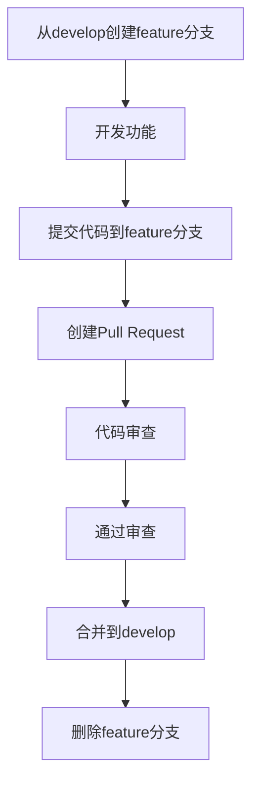

# 工程团队 - Git使用规范

_版本 1.0 · 2026-04-13_

---

## 1. 分支策略

### 1.1 主干分支
```
main/master (保护分支)
    ↑
develop (开发分支)
    ↑
feature/* (功能分支)
```

### 1.2 分支类型
| 分支类型 | 命名 | 用途 | 生命周期 |
|----------|------|------|----------|
| 主干分支 | `main` | 生产环境代码 | 永久 |
| 开发分支 | `develop` | 集成测试环境 | 永久 |
| 功能分支 | `feature/{功能名}` | 新功能开发 | 功能完成合并后删除 |
| 修复分支 | `hotfix/{问题号}` | 紧急Bug修复 | 修复完成合并后删除 |
| 发布分支 | `release/{版本号}` | 版本发布准备 | 发布后删除 |

### 1.3 分支创建规则
```bash
# 从develop创建功能分支
git checkout develop
git pull origin develop
git checkout -b feature/user-login

# 从main创建热修复分支
git checkout main
git pull origin main  
git checkout -b hotfix/login-error-001
```

---

## 2. 提交规范

### 2.1 提交信息格式
```
<类型>: <简短描述>

<详细描述>

<关联事项>
```

### 2.2 提交类型
| 类型 | 说明 | 示例 |
|------|------|------|
| `feat` | 新功能 | `feat: 添加用户登录功能` |
| `fix` | Bug修复 | `fix: 修复登录页面样式问题` |
| `docs` | 文档更新 | `docs: 更新API接口文档` |
| `style` | 代码格式 | `style: 修复代码缩进问题` |
| `refactor` | 重构代码 | `refactor: 重构用户服务类` |
| `test` | 测试相关 | `test: 添加用户登录测试用例` |
| `chore` | 构建/工具 | `chore: 更新依赖包版本` |
| `perf` | 性能优化 | `perf: 优化数据库查询性能` |

### 2.3 提交示例
```bash
git commit -m "feat: 添加用户注册功能

- 实现用户注册API接口
- 添加邮箱验证功能
- 完善用户数据校验

关联: #123"
```

---

## 3. 合并流程

### 3.1 功能开发流程


### 3.2 Pull Request规范
**标题格式**: `[类型] 简要描述`
```
[feat] 添加用户登录功能
[fix] 修复登录页面样式问题
```

**描述模板**:
```
## 变更内容
- 变更1
- 变更2

## 测试说明
- [x] 单元测试通过
- [x] 集成测试通过
- [ ] UI测试通过

## 关联事项
- 关联 #123
- 解决 #456
```

### 3.3 合并策略
- **feature → develop**: Squash Merge (压缩提交)
- **hotfix → main**: Merge Commit (合并提交)
- **develop → main**: Rebase Merge (变基合并)

---

## 4. 代码审查

### 4.1 审查要点
| 类别 | 检查项 |
|------|--------|
| 功能 | 需求是否完整实现 |
| 代码质量 | 是否符合编码规范 |
| 测试 | 测试是否充分 |
| 安全 | 是否有安全隐患 |
| 性能 | 性能是否满足要求 |

### 4.2 审查流程
1. **开发者**：创建PR，添加审查者
2. **审查者**：24小时内完成审查
3. **反馈**：提供具体修改建议
4. **修改**：开发者根据反馈修改
5. **批准**：审查者批准合并

### 4.3 审查意见格式
```
## 总体评价
[良好/需要改进/拒绝]

## 具体建议
**文件: src/service/user.py**
- 第45行: 建议使用XXX方法替代
- 第78行: 需要添加异常处理

## 必须修改项
- [ ] 修复XXX问题
- [ ] 添加XXX测试

## 建议改进项
- [ ] 考虑优化XXX
- [ ] 可以添加XXX功能
```

---

## 5. 版本管理

### 5.1 版本号规范
**语义化版本**: `主版本.次版本.修订版本`
- `主版本`: 不兼容的API修改
- `次版本`: 向下兼容的功能性新增
- `修订版本`: 向下兼容的问题修正

### 5.2 版本发布流程
1. 从develop创建release分支
2. 在release分支进行测试和修复
3. 合并release到main和develop
4. 在main创建tag并推送
5. 删除release分支

```bash
# 创建发布分支
git checkout develop
git checkout -b release/v1.2.0

# 发布后合并
git checkout main
git merge --no-ff release/v1.2.0
git tag -a v1.2.0 -m "Release v1.2.0"

# 同步到develop
git checkout develop
git merge --no-ff release/v1.2.0

# 删除发布分支
git branch -d release/v1.2.0
```

---

## 6. 日常操作

### 6.1 常用命令
```bash
# 查看状态
git status
git log --oneline --graph

# 暂存和提交
git add .
git commit -m "feat: 添加功能"

# 分支操作
git branch -a
git checkout -b feature/xxx
git branch -d feature/xxx

# 同步远程
git pull origin develop --rebase
git push origin feature/xxx

# 暂存区操作
git stash
git stash pop
git stash list
```

### 6.2 冲突解决
```bash
# 拉取最新代码
git pull origin develop

# 如果有冲突
git status  # 查看冲突文件
# 编辑冲突文件，解决冲突
git add .
git commit -m "fix: 解决合并冲突"
```

### 6.3 撤销操作
| 场景 | 命令 | 说明 |
|------|------|------|
| 撤销工作区修改 | `git checkout -- <file>` | 危险！不可恢复 |
| 撤销暂存区修改 | `git reset HEAD <file>` | 保留工作区修改 |
| 撤销最近提交 | `git reset --soft HEAD^` | 保留修改到暂存区 |
| 撤销到指定提交 | `git reset --hard <commit>` | 危险！丢弃所有修改 |

---

## 7. 工具配置

### 7.1 Git配置文件
`.gitconfig`:
```ini
[user]
    name = Your Name
    email = your.email@example.com
    
[core]
    autocrlf = input
    safecrlf = warn
    
[push]
    default = simple
    
[pull]
    rebase = true
    
[alias]
    lg = log --oneline --graph --all
    st = status
    co = checkout
    br = branch
```

### 7.2 Commit Message模板
`.gitmessage`:
```
# <类型>: <简短描述>
# | feat | fix | docs | style | refactor | test | chore | perf |
# 
# <详细描述>
# 
# <关联事项>
# 关联: #123
```

配置：
```bash
git config commit.template .gitmessage
```

### 7.3 钩子配置
`.git/hooks/pre-commit`:
```bash
#!/bin/bash
# 运行代码检查
flake8 .
# 运行测试
pytest tests/unit/
```

---

## 8. 最佳实践

### 8.1 提交粒度
- **一次提交一个功能**：不要混合多个功能
- **小步提交**：频繁提交，便于回滚
- **完整提交**：确保每次提交都可以独立编译运行

### 8.2 分支管理
- **及时删除分支**：合并后删除feature分支
- **定期同步**：每天同步develop分支
- **避免长生命周期分支**：分支生命周期不超过2周

### 8.3 协作规范
- **提前沟通**：涉及多人修改时提前沟通
- **及时审查**：PR创建后24小时内审查
- **友好反馈**：审查意见要具体、建设性

---

## 9. 常见问题

### 9.1 如何回滚错误提交？
```bash
# 查看提交历史
git log --oneline

# 回滚到指定提交
git reset --hard <commit_id>

# 强制推送到远程（谨慎使用）
git push origin main --force
```

### 9.2 如何合并多个提交？
```bash
# 合并最近3个提交
git rebase -i HEAD~3
# 在编辑器中将后2个提交改为"squash"
```

### 9.3 如何恢复删除的分支？
```bash
# 查找删除的分支
git reflog

# 恢复分支
git checkout -b feature/xxx <commit_id>
```

---

## 附录

### A. Git流程图
```
开发者工作流:
    开始 → 拉取最新代码 → 创建功能分支 → 开发功能
    ↓
    提交代码 → 推送远程 → 创建PR → 代码审查
    ↓
    修改代码 → 再次提交 → 通过审查 → 合并分支
```

### B. 参考资源
- [Git官方文档](https://git-scm.com/doc)
- [Conventional Commits](https://www.conventionalcommits.org/)
- [GitHub Flow](https://guides.github.com/introduction/flow/)

---

_本规范由工程团队 @Architect 编写，团队全员遵守执行_