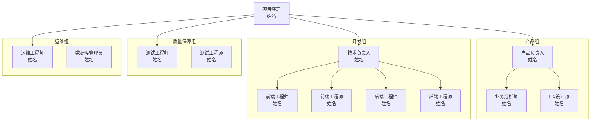
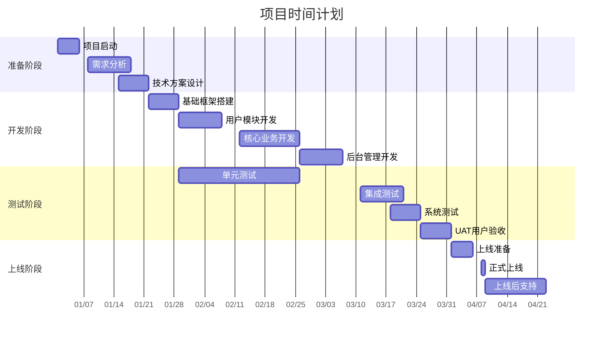
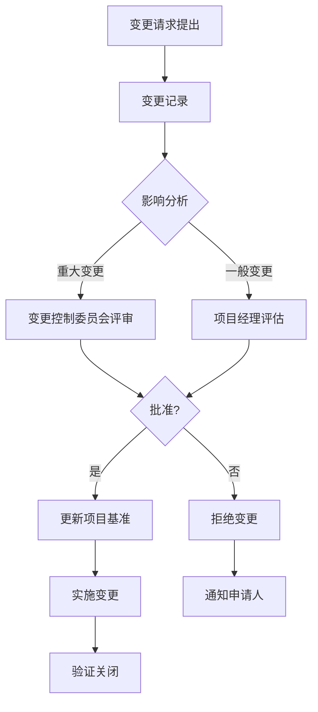

# 项目计划模板

_项目名称：`<项目名称>` | 计划版本：`1.0.0` | 日期：`YYYY-MM-DD`_

---

## 1. 项目摘要

### 1.1 项目基本信息
| 项目属性 | 内容 |
|----------|------|
| **项目名称** | `<项目名称>` |
| **项目代号** | `<项目代号>` |
| **项目类型** | 新产品开发 / 功能增强 / 技术重构 |
| **业务部门** | `<部门名称>` |
| **项目经理** | `<姓名>` |
| **项目周期** | `YYYY-MM-DD` 至 `YYYY-MM-DD`（共 `<X>` 周） |
| **预算总额** | `¥<金额>` |

### 1.2 项目目标
**商业目标**：
1. 提高`<业务指标>` `X%`
2. 降低`<成本指标>` `Y%`
3. 进入`<市场领域>`，获得`<用户数量>`用户

**技术目标**：
1. 系统可用性达到`99.9%`
2. 核心接口响应时间`<200ms`（p95）
3. 代码质量：测试覆盖率`>80%`，无高危安全漏洞

### 1.3 成功标准
- [ ] 用户满意度调查`>4.5/5`
- [ ] 线上bug率`<0.1%`
- [ ] 按时交付率`100%`
- [ ] 预算控制率`±10%`以内

---

## 2. 项目范围

### 2.1 包含范围
| 模块 | 功能描述 | 优先级 | 负责人 |
|------|----------|--------|--------|
| **用户管理** | 注册/登录/个人资料/权限管理 | P0 | `<姓名>` |
| **核心业务** | `<具体业务功能>` | P0 | `<姓名>` |
| **后台管理** | 数据管理/统计分析/系统配置 | P1 | `<姓名>` |
| **第三方集成** | 支付/短信/邮件/存储服务 | P1 | `<姓名>` |

### 2.2 排除范围
1. **功能排除**：
   - 不包含移动端原生App开发（仅响应式Web）
   - 不包含多语言国际化（v1.0仅中文）
   - 不包含高级报表定制功能（基础报表仅支持导出）

2. **技术排除**：
   - 不兼容IE11及以下浏览器
   - 不支持本地部署版本（仅SaaS云服务）
   - 不提供源码交付

### 2.3 假设条件
1. **资源假设**：
   - 项目成员全职投入，无重大人员变动
   - 第三方服务（云平台、CDN）稳定可用
   - 客户需求在需求冻结后无重大变更

2. **技术假设**：
   - 所选技术栈社区支持良好
   - 开源组件无重大安全漏洞
   - 系统依赖的API服务稳定

---

## 3. 项目团队

### 3.1 组织架构


### 3.2 角色职责
| 角色 | 主要职责 | 关键产出 |
|------|----------|----------|
| **项目经理** | 项目整体规划、进度跟踪、风险管理、干系人沟通 | 项目计划、状态报告、风险管理清单 |
| **产品负责人** | 需求管理、优先级排序、验收标准定义 | 产品路线图、用户故事、验收标准 |
| **技术负责人** | 技术架构设计、代码质量把控、技术风险管理 | 技术方案、代码规范、技术决策文档 |
| **开发工程师** | 功能开发、代码编写、单元测试、技术文档 | 功能模块、单元测试、技术文档 |
| **测试工程师** | 测试计划、用例设计、缺陷跟踪、质量报告 | 测试用例、缺陷报告、测试报告 |
| **运维工程师** | 环境部署、监控告警、性能优化、安全加固 | 部署脚本、监控面板、运维手册 |

### 3.3 沟通机制
| 会议 | 频率 | 参与人 | 议程 |
|------|------|--------|------|
| **每日站会** | 工作日 9:30-9:45 | 全员 | 昨日进展、今日计划、阻塞问题 |
| **需求评审** | 每周一 14:00-15:30 | 产品+开发+测试 | 评审新需求、澄清疑问 |
| **技术评审** | 每周三 10:00-11:30 | 技术团队 | 架构设计、技术方案、代码审查 |
| **迭代规划** | 每两周周一 9:00-11:00 | 全员 | 确定迭代目标、任务拆分、工作量评估 |
| **项目周会** | 每周五 16:00-17:00 | 核心成员+干系人 | 进度汇报、风险讨论、下周计划 |
| **上线评审** | 上线前1天 | 核心成员 | 上线检查清单、回滚方案 |

---

## 4. 时间计划

### 4.1 项目里程碑
| 里程碑 | 日期 | 交付物 | 成功标准 |
|--------|------|--------|----------|
| **M1：项目启动** | YYYY-MM-DD | 项目章程、团队组建、环境准备 | 所有成员就位，开发环境可用 |
| **M2：需求分析完成** | YYYY-MM-DD | 需求文档、原型设计、技术方案 | 需求评审通过，技术方案确定 |
| **M3：核心功能完成** | YYYY-MM-DD | 用户管理、核心业务模块 | 核心功能测试通过，性能达标 |
| **M4：功能测试完成** | YYYY-MM-DD | 测试报告、缺陷修复、用户文档 | 所有P0/P1缺陷关闭，文档齐全 |
| **M5：UAT验收完成** | YYYY-MM-DD | UAT报告、上线计划、培训材料 | 用户验收通过，上线准备就绪 |
| **M6：正式上线** | YYYY-MM-DD | 生产环境、监控告警、运维手册 | 系统稳定运行，用户反馈良好 |
| **M7：项目收尾** | YYYY-MM-DD | 项目总结、经验教训、知识库 | 所有文档归档，团队复盘完成 |

### 4.2 详细时间表（甘特图）


### 4.3 迭代计划（敏捷开发）
**迭代周期**：2周（10个工作日）

| 迭代 | 日期范围 | 主要目标 | 故事点数 |
|------|----------|----------|----------|
| **Iteration 1** | 01.01-01.12 | 项目脚手架、用户登录注册 | 20 |
| **Iteration 2** | 01.15-01.26 | 用户管理完整功能、个人中心 | 25 |
| **Iteration 3** | 01.29-02.09 | 核心业务模块v1.0 | 30 |
| **Iteration 4** | 02.12-02.23 | 核心业务模块v2.0、后台管理基础 | 28 |
| **Iteration 5** | 02.26-03.08 | 后台管理完整功能、报表统计 | 25 |
| **Iteration 6** | 03.11-03.22 | 集成测试、性能优化、安全加固 | 20 |
| **Iteration 7** | 03.25-04.05 | UAT测试、bug修复、文档完善 | 15 |
| **Iteration 8** | 04.08-04.19 | 上线部署、监控配置、运维支持 | 10 |

---

## 5. 资源计划

### 5.1 人力资源
| 角色 | 人数 | 投入程度 | 时间范围 | 主要工作 |
|------|------|----------|----------|----------|
| 项目经理 | 1 | 100% | 全程 | 项目管理、沟通协调 |
| 产品负责人 | 1 | 50% | 第1-4月 | 需求分析、产品设计 |
| 前端工程师 | 2 | 100% | 第2-7月 | 前端开发、界面优化 |
| 后端工程师 | 2 | 100% | 第2-7月 | 后端开发、API设计 |
| 测试工程师 | 1 | 100% | 第4-8月 | 测试设计、质量保障 |
| 运维工程师 | 1 | 50% | 第7-8月 | 环境部署、监控配置 |

**总人月**：`<X>`人月

### 5.2 硬件资源
| 资源类型 | 规格 | 数量 | 用途 | 成本/月 |
|----------|------|------|------|----------|
| **开发服务器** | 4核8G 100G SSD | 2台 | 开发测试环境 | ¥800 |
| **测试服务器** | 8核16G 200G SSD | 1台 | 集成测试环境 | ¥1,200 |
| **生产服务器** | 16核32G 500G SSD | 2台（主备） | 生产环境 | ¥3,200 |
| **数据库服务器** | 8核16G 1T SSD | 1台 | 生产数据库 | ¥2,500 |
| **缓存服务器** | 4核8G 100G SSD | 1台 | Redis缓存 | ¥600 |

### 5.3 软件资源
| 软件/服务 | 版本/套餐 | 数量 | 用途 | 成本 |
|-----------|-----------|------|------|------|
| **开发工具** | JetBrains全家桶 | 5套 | 开发IDE | 公司已有 |
| **代码仓库** | GitHub Team | 1个 | 代码管理 | ¥25/月 |
| **项目管理** | Jira Cloud | 10用户 | 任务跟踪 | ¥70/月 |
| **文档协作** | Confluence | 10用户 | 知识管理 | ¥50/月 |
| **持续集成** | Jenkins自建 | 1套 | CI/CD | 免费 |
| **云存储** | AWS S3 | 100GB | 文件存储 | ¥20/月 |
| **CDN服务** | Cloudflare | 免费版 | 静态加速 | 免费 |

**月度总成本估算**：¥`<金额>`/月

---

## 6. 风险管理

### 6.1 风险登记册
| 风险ID | 风险描述 | 概率 | 影响 | 风险等级 | 应对策略 | 负责人 |
|--------|----------|------|------|----------|----------|--------|
| R001 | 关键人员离职 | 中 | 高 | 高 | 1. 知识共享文档化<br>2. 交叉培训<br>3. 招聘储备 | 项目经理 |
| R002 | 需求范围蔓延 | 高 | 中 | 高 | 1. 变更控制流程<br>2. 优先级排序<br>3. 迭代增量交付 | 产品负责人 |
| R003 | 技术选型问题 | 低 | 高 | 中 | 1. 技术验证（PoC）<br>2. 备选方案<br>3. 社区支持评估 | 技术负责人 |
| R004 | 第三方服务故障 | 中 | 中 | 中 | 1. 服务降级方案<br>2. 本地缓存<br>3. 多服务商备用 | 后端工程师 |
| R005 | 安全漏洞 | 低 | 高 | 中 | 1. 安全开发规范<br>2. 代码扫描<br>3. 渗透测试 | 技术负责人 |
| R006 | 进度延误 | 中 | 中 | 中 | 1. 每日站会跟踪<br>2. 缓冲时间预留<br>3. 关键路径优化 | 项目经理 |

### 6.2 风险应对计划
**规避**（高风险）：
- 技术风险：进行充分的技术验证和原型开发
- 人员风险：建立团队知识库，减少单点依赖

**转移**（中风险）：
- 第三方服务风险：选择有SLA保障的服务商，购买商业支持
- 安全风险：购买安全扫描服务，进行专业渗透测试

**减轻**（中低风险）：
- 进度风险：采用敏捷开发，缩短反馈周期
- 质量风险：加强代码审查，自动化测试覆盖

**接受**（低风险）：
- 轻微需求变更：预留15%的缓冲时间
- 非核心功能缺陷：记录在案，后续版本修复

---

## 7. 质量管理

### 7.1 质量目标
| 质量维度 | 指标 | 目标值 | 测量方法 |
|----------|------|--------|----------|
| **功能性** | 需求覆盖率 | 100% | 需求跟踪矩阵 |
| | 缺陷密度 | <0.5个/KLOC | 代码审查+测试 |
| **可靠性** | 系统可用性 | >99.9% | 监控系统统计 |
| | MTTR（平均修复时间） | <30分钟 | 故障响应记录 |
| **性能** | API响应时间（p95） | <200ms | 性能测试工具 |
| | 页面加载时间 | <2秒 | Web性能监控 |
| **安全性** | 安全漏洞数量 | 0高危 | 安全扫描报告 |
| | 合规性检查 | 100%通过 | 合规审计 |
| **可维护性** | 代码重复率 | <5% | 静态代码分析 |
| | 测试覆盖率 | >80% | 测试报告 |

### 7.2 质量控制活动
| 阶段 | 质量控制活动 | 参与人 | 输出物 |
|------|--------------|--------|--------|
| **需求分析** | 需求评审、原型评审 | 产品、开发、测试 | 评审记录、需求基线 |
| **设计阶段** | 技术方案评审、架构评审 | 架构师、开发 | 技术决策文档 |
| **编码阶段** | 代码审查、单元测试、静态分析 | 开发人员 | 代码审查记录、测试报告 |
| **测试阶段** | 测试用例评审、缺陷跟踪 | 测试、开发 | 测试报告、缺陷报告 |
| **发布阶段** | 上线检查清单、验收测试 | 运维、测试、产品 | 上线报告、验收报告 |

### 7.3 质量保证措施
1. **自动化测试**：
   - 单元测试：Jest（前端）、pytest（后端）
   - 集成测试：Cypress（E2E）、Postman（API）
   - 性能测试：k6、Locust

2. **代码质量**：
   - 代码规范：ESLint、Prettier、Black
   - 安全扫描：SonarQube、OWASP Dependency Check
   - 文档生成：自动生成API文档（Swagger）

3. **持续集成**：
   - 每次提交触发自动化构建和测试
   - 代码覆盖率报告强制要求
   - 安全扫描集成到CI流水线

---

## 8. 沟通管理

### 8.1 干系人分析
| 干系人 | 角色 | 利益关注点 | 沟通频率 | 沟通方式 |
|--------|------|------------|----------|----------|
| **项目发起人** | 高层管理者 | 商业价值、投资回报、战略对齐 | 每月 | 项目报告、季度评审 |
| **产品总监** | 业务负责人 | 产品功能、用户体验、市场竞争力 | 每周 | 周会、需求评审 |
| **开发团队** | 执行团队 | 技术挑战、工作负荷、开发效率 | 每日 | 站会、技术评审 |
| **测试团队** | 质量团队 | 测试覆盖、缺陷管理、质量标准 | 每日 | 站会、测试报告 |
| **运维团队** | 运维团队 | 系统稳定性、监控告警、部署流程 | 每周 | 运维会议、上线评审 |
| **最终用户** | 使用者 | 易用性、功能完整性、性能 | 每迭代 | 用户反馈、UAT测试 |

### 8.2 沟通计划
| 沟通项 | 内容 | 频率 | 参与者 | 负责人 | 交付物 |
|--------|------|------|--------|--------|--------|
| **项目状态报告** | 进度、风险、问题、下周计划 | 每周五 | 所有干系人 | 项目经理 | PDF报告 |
| **技术周报** | 技术进展、架构决策、技术风险 | 每周三 | 技术团队 | 技术负责人 | 技术文档 |
| **迭代演示** | 迭代成果展示、用户反馈收集 | 每迭代结束 | 产品+开发+用户代表 | 产品负责人 | 演示记录 |
| **风险评审会** | 风险状态、应对措施效果 | 每两周 | 核心团队 | 项目经理 | 风险报告 |
| **变更控制会** | 需求变更评估、影响分析 | 按需 | 变更控制委员会 | 项目经理 | 变更记录 |

### 8.3 信息分发
- **即时沟通**：钉钉/企业微信群，用于日常协调
- **文档管理**：Confluence/Wiki，用于知识沉淀
- **任务跟踪**：Jira/Trello，用于进度可视化
- **代码管理**：GitHub/GitLab，用于版本控制和协作
- **报告分发**：邮件+在线文档，确保信息透明

---

## 9. 变更管理

### 9.1 变更控制流程


### 9.2 变更请求模板
```markdown
## 变更请求 CR-XXX

**请求人**：`<姓名>`
**日期**：`YYYY-MM-DD`
**变更类型**：需求/设计/范围/时间/成本/资源

**变更描述**：
（详细描述变更内容，包括变更原因）

**影响分析**：
- **范围影响**：
- **时间影响**：
- **成本影响**：
- **质量影响**：
- **风险影响**：

**建议方案**：
（建议的实施方式）

**附件**：
（相关文档、原型、数据等）
```

### 9.3 变更控制委员会（CCB）
| 角色 | 成员 | 职责 |
|------|------|------|
| **主席** | 项目经理 | 主持会议，最终决策 |
| **业务代表** | 产品负责人 | 评估业务影响和价值 |
| **技术代表** | 技术负责人 | 评估技术可行性和工作量 |
| **质量代表** | 测试负责人 | 评估质量影响和测试工作量 |
| **财务代表** | 财务专员（可选） | 评估成本影响 |

---

## 10. 附录

### 10.1 项目文档清单
| 文档名称 | 版本 | 负责人 | 状态 | 存储位置 |
|----------|------|--------|------|----------|
| 项目章程 | 1.0 | 项目经理 | 已批准 | Confluence |
| 需求规格说明书 | 1.2 | 产品负责人 | 评审中 | Confluence |
| 技术方案设计 | 1.1 | 技术负责人 | 已批准 | Confluence |
| 测试计划 | 1.0 | 测试负责人 | 草稿 | Confluence |
| 运维部署手册 | 0.9 | 运维工程师 | 编写中 | Wiki |

### 10.2 模板和工具
1. **会议模板**：会议议程、会议纪要、行动项跟踪
2. **报告模板**：周报、月报、里程碑报告
3. **评估模板**：工作量评估、风险评估、变更评估
4. **工具配置**：Jira工作流、Git分支策略、CI/CD配置

### 10.3 参考项目
1. **类似项目A**：`<项目名称>`，成功经验：`<经验总结>`
2. **类似项目B**：`<项目名称>`，失败教训：`<教训总结>`

---

**计划状态**：`草案/评审中/基线化/执行中`

**编制人**：`<姓名>`（项目经理）

**评审人**：`<姓名1>`，`<姓名2>`，`<姓名3>`

**批准人**：`<姓名>`（项目发起人）

**批准日期**：`YYYY-MM-DD`