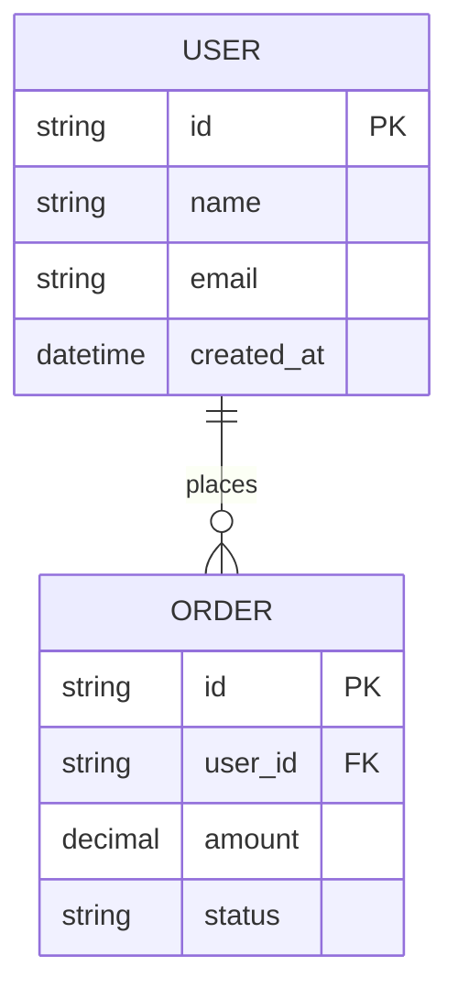

# 需求分析文档模板

_项目名称：`<项目名称>` | 版本：`1.0.0` | 日期：`YYYY-MM-DD`_

---

## 1. 项目概述

### 1.1 项目背景
- **业务背景**：简要描述项目产生的业务背景、市场环境或技术趋势
- **问题陈述**：当前存在的痛点、挑战或机会
- **项目目标**：通过本项目期望达到的核心目标

### 1.2 项目范围
- **包含范围**（In-scope）：
  - 功能模块A：...
  - 功能模块B：...
  - 技术组件C：...
- **排除范围**（Out-of-scope）：
  - 暂不支持的平台/浏览器
  - 不包含的第三方集成
  - 未来版本规划的功能

### 1.3 目标用户
| 用户角色 | 主要特征 | 核心需求 | 使用场景 |
|----------|----------|----------|----------|
| 管理员 | 技术背景强，负责系统维护 | 系统配置、用户管理、监控告警 | 日常运维、故障处理 |
| 普通用户 | 业务操作人员 | 快速完成任务，界面友好 | 日常业务处理 |
| 访客 | 临时访问者 | 查看基本信息 | 浏览公开内容 |

---

## 2. 功能需求

### 2.1 功能模块A
#### 2.1.1 功能描述
- **功能名称**：`<功能名称>`
- **优先级**：`P0/P1/P2/P3`
- **用户故事**：作为`<角色>`，我希望`<目标>`，以便`<价值>`
- **验收标准**：
  - 场景1：给定`<条件>`，当`<操作>`，那么`<结果>`
  - 场景2：...
- **业务规则**：
  - 规则1：...
  - 约束条件：...

#### 2.1.2 界面要求
- 页面布局：...
- 交互流程：...
- 响应式要求：支持桌面/平板/手机

### 2.2 功能模块B
_（结构与2.1相同）_

---

## 3. 非功能需求

### 3.1 性能需求
| 指标 | 要求 | 测量方法 |
|------|------|----------|
| 响应时间 | 页面加载 < 2s，API响应 < 500ms | 95分位值 |
| 并发用户 | 支持1000并发用户 | 压力测试 |
| 吞吐量 | 1000 TPS | 基准测试 |
| 数据量 | 支持百万级数据记录 | 容量规划 |

### 3.2 可用性需求
- **易用性**：新手用户10分钟内完成核心操作
- **可访问性**：符合WCAG 2.1 AA标准
- **错误处理**：友好的错误提示和恢复引导

### 3.3 安全性需求
- 认证：支持多因素认证
- 授权：基于角色的访问控制（RBAC）
- 数据加密：传输TLS 1.3，存储AES-256
- 审计：完整操作日志，保留180天

### 3.4 兼容性需求
| 项目 | 要求 |
|------|------|
| 浏览器 | Chrome 90+，Firefox 88+，Safari 14+，Edge 90+ |
| 操作系统 | Windows 10/11，macOS 11+，主流Linux发行版 |
| 移动端 | iOS 14+，Android 10+（响应式设计） |

---

## 4. 数据需求

### 4.1 数据模型

### 4.2 数据量估算
- 初始数据量：`<数量>`条记录
- 年增长率：`<百分比>%`
- 3年预估：`<总数量>`条记录

### 4.3 数据迁移
- 迁移源：现有系统/Excel/第三方API
- 迁移策略：全量/增量/双写
- 数据清洗：规则说明...

---

## 5. 约束条件

### 5.1 技术约束
- 编程语言：Python 3.11+/JavaScript ES2022+
- 框架：Django 4.2+/Vue 3.3+
- 数据库：PostgreSQL 15+/MySQL 8.0+
- 部署：Docker容器化，K8s编排

### 5.2 商业约束
- 预算限制：`<金额>`元
- 时间约束：`<日期>`前上线
- 合规要求：GDPR/网络安全法/行业规范

### 5.3 第三方依赖
| 服务/组件 | 用途 | 替代方案 | SLA要求 |
|-----------|------|----------|----------|
| 支付网关 | 在线支付 | 备选支付通道 | 99.9% |
| 短信服务 | 验证码发送 | 邮件验证 | 99.5% |
| 对象存储 | 文件存储 | 本地存储 | 99.9% |

---

## 6. 项目交付物

### 6.1 文档交付物
1. 技术设计文档
2. API接口文档（OpenAPI 3.0）
3. 用户操作手册
4. 部署运维手册

### 6.2 代码交付物
1. 源代码仓库（Git）
2. 持续集成配置
3. Docker镜像
4. 部署脚本

### 6.3 测试交付物
1. 测试用例集
2. 自动化测试脚本
3. 性能测试报告
4. 安全扫描报告

---

## 7. 验收标准

### 7.1 功能验收
- [ ] 所有P0/P1功能测试通过
- [ ] 核心业务流程端到端验证
- [ ] 第三方集成正常工作

### 7.2 非功能验收
- [ ] 性能测试达标
- [ ] 安全扫描无高危漏洞
- [ ] 兼容性测试通过

### 7.3 文档验收
- [ ] 所有交付文档齐全
- [ ] 文档内容准确完整
- [ ] 代码注释覆盖率>80%

---

## 8. 附录

### 8.1 术语表
| 术语 | 定义 |
|------|------|
| TPS | 每秒事务数 |
| SLA | 服务级别协议 |
| RBAC | 基于角色的访问控制 |

### 8.2 参考资料
1. 竞品分析报告
2. 用户调研报告
3. 技术调研报告

### 8.3 变更记录
| 版本 | 日期 | 修改内容 | 修改人 |
|------|------|----------|--------|
| 1.0.0 | YYYY-MM-DD | 初始版本 | 姓名 |
| ... | ... | ... | ... |

---

**文档状态**：`草案/评审中/已批准`

**评审人**：`<姓名1>`，`<姓名2>`，`<姓名3>`

**批准人**：`<姓名>`（产品负责人）