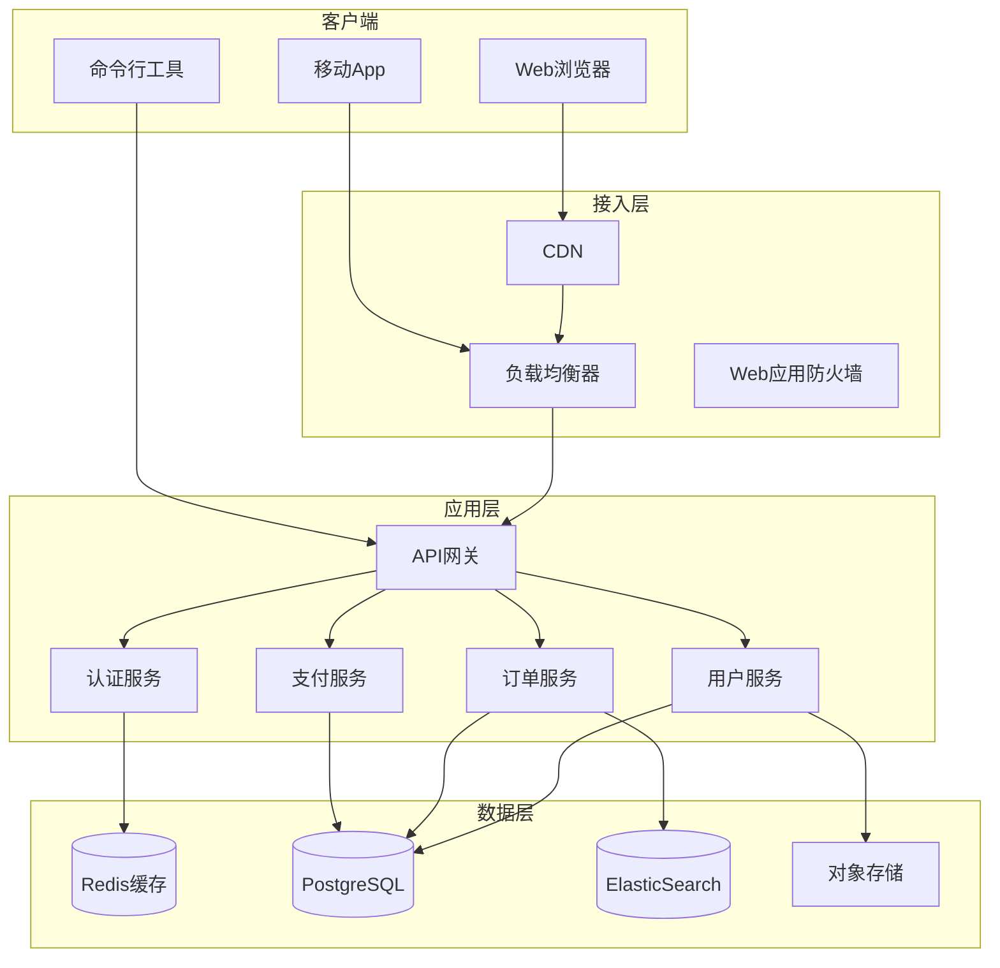
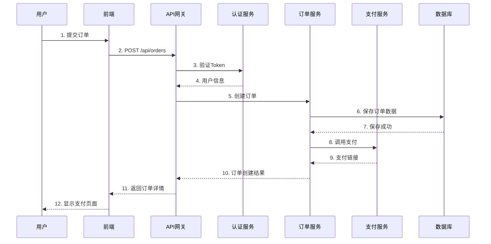
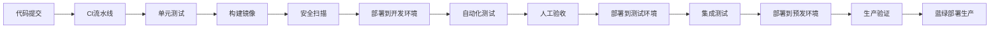

# 技术方案模板

_项目名称：`<项目名称>` | 方案版本：`1.0.0` | 日期：`YYYY-MM-DD`_

---

## 1. 方案概述

### 1.1 方案背景
基于需求文档`<需求文档版本>`，针对`<核心业务问题>`提出的技术解决方案。

### 1.2 设计目标
| 目标维度 | 具体指标 |
|----------|----------|
| **功能性** | 100%覆盖需求文档中P0/P1功能 |
| **性能** | API响应时间<200ms（p95），支持1000并发 |
| **可扩展性** | 支持水平扩展，线性提升处理能力 |
| **可维护性** | 模块化设计，单模块变更不影响整体 |
| **成本控制** | 充分利用现有基础设施，控制云资源成本 |

### 1.3 方案对比
| 方案选项 | 优点 | 缺点 | 推荐度 |
|----------|------|------|--------|
| **方案A：微服务架构** | 高可扩展性，独立部署 | 复杂度高，运维成本大 | ★★★☆☆ |
| **方案B：单体应用+模块化** | 开发简单，部署容易 | 扩展性有限 | ★★★★★（推荐） |
| **方案C：Serverless** | 弹性伸缩，按需付费 | 冷启动延迟，厂商锁定 | ★★☆☆☆ |

**推荐方案**：`方案B`，理由：`<详细说明>`

---

## 2. 系统架构

### 2.1 架构图


### 2.2 架构决策
| 决策点 | 选择 | 理由 | 影响 |
|--------|------|------|------|
| 前后端分离 | ✅ 采用 | 团队技术栈匹配，便于独立开发 | 需要API设计规范 |
| 微服务粒度 | 按业务领域划分 | 高内聚低耦合，团队自治 | 服务间通信复杂度 |
| 数据库选型 | PostgreSQL | 事务支持完善，JSONB支持 | 需要DBA技能 |
| 缓存策略 | Redis + 本地缓存二级缓存 | 高性能，降低成本 | 缓存一致性处理 |

### 2.3 技术栈
| 层级 | 技术选型 | 版本 | 备注 |
|------|----------|------|------|
| **前端** | Vue 3 + TypeScript | 3.3+ | Composition API，Vite构建 |
| | Element Plus | 2.3+ | UI组件库 |
| | Axios | 1.6+ | HTTP客户端 |
| **后端** | Python + FastAPI | 3.11+/0.104+ | 异步支持好，性能优异 |
| | SQLAlchemy | 2.0+ | ORM工具 |
| | Pydantic | 2.5+ | 数据验证 |
| **数据存储** | PostgreSQL | 15+ | 主数据库 |
| | Redis | 7.2+ | 缓存/会话存储 |
| | MinIO | 最新 | 自托管对象存储 |
| **基础设施** | Docker | 24.0+ | 容器化 |
| | Kubernetes | 1.28+ | 容器编排（可选） |
| | GitHub Actions | 最新 | CI/CD |
| **监控告警** | Prometheus | 2.47+ | 指标收集 |
| | Grafana | 10.1+ | 数据可视化 |
| | Sentry | 最新 | 错误跟踪 |

---

## 3. 详细设计

### 3.1 核心业务流程


### 3.2 数据库设计
#### 3.2.1 核心表结构
```sql
-- 用户表
CREATE TABLE users (
    id UUID PRIMARY KEY DEFAULT gen_random_uuid(),
    username VARCHAR(50) UNIQUE NOT NULL,
    email VARCHAR(255) UNIQUE NOT NULL,
    password_hash VARCHAR(255) NOT NULL,
    status VARCHAR(20) DEFAULT 'active',
    created_at TIMESTAMP DEFAULT CURRENT_TIMESTAMP,
    updated_at TIMESTAMP DEFAULT CURRENT_TIMESTAMP
);

-- 订单表
CREATE TABLE orders (
    id UUID PRIMARY KEY DEFAULT gen_random_uuid(),
    user_id UUID REFERENCES users(id) ON DELETE CASCADE,
    order_number VARCHAR(50) UNIQUE NOT NULL,
    amount DECIMAL(10, 2) NOT NULL,
    currency VARCHAR(3) DEFAULT 'CNY',
    status VARCHAR(20) DEFAULT 'pending',
    items JSONB NOT NULL DEFAULT '[]',
    created_at TIMESTAMP DEFAULT CURRENT_TIMESTAMP,
    INDEX idx_orders_user_id (user_id),
    INDEX idx_orders_status (status)
);
```

#### 3.2.2 索引策略
- 主键：UUID，分布式友好
- 外键索引：所有关联字段建立索引
- 查询索引：高频查询条件组合索引
- 全文索引：搜索字段使用GIN索引

### 3.3 API设计
#### 3.3.1 RESTful规范
- 资源命名：复数名词，小写+连字符 `/api/orders`
- HTTP方法：GET获取，POST创建，PUT全量更新，PATCH部分更新，DELETE删除
- 版本管理：URL路径版本 `/api/v1/orders`
- 响应格式：统一JSON格式，包含`code`、`message`、`data`、`timestamp`

#### 3.3.2 认证授权
- 认证方式：JWT（Bearer Token）
- 权限控制：RBAC模型，接口级别细粒度控制
- 限流策略：令牌桶算法，IP+用户双重限流

### 3.4 安全设计
#### 3.4.1 安全控制点
| 安全领域 | 控制措施 | 实现方式 |
|----------|----------|----------|
| **身份认证** | 多因素认证 | JWT + TOTP（可选） |
| **访问控制** | 最小权限原则 | RBAC + 属性权限 |
| **数据安全** | 加密存储 | AES-256 + 盐值哈希 |
| **传输安全** | TLS加密 | Let's Encrypt证书 |
| **审计追踪** | 完整日志 | 结构化日志+操作审计 |

#### 3.4.2 漏洞防护
- SQL注入：预编译语句，ORM参数化查询
- XSS：输入过滤，输出编码，CSP策略
- CSRF：SameSite Cookie，Anti-CSRF Token
- 文件上传：文件类型校验，病毒扫描，权限控制

---

## 4. 非功能设计

### 4.1 性能设计
#### 4.1.1 缓存策略
| 缓存级别 | 技术 | 缓存内容 | TTL |
|----------|------|----------|-----|
| **客户端** | 浏览器缓存 | 静态资源 | 长期 |
| **CDN** | Cloudflare | 全球静态资源 | 1小时 |
| **服务端** | Redis | 热点数据，会话 | 5分钟-1小时 |
| **数据库** | 查询缓存 | 复杂查询结果 | 10分钟 |

#### 4.1.2 异步处理
- 耗时操作：消息队列（Redis Streams/RabbitMQ）
- 批处理：夜间任务，减少白天压力
- 流处理：实时数据管道（可选）

### 4.2 可用性设计
#### 4.2.1 容错机制
- 服务降级：非核心功能可降级
- 熔断器：失败率>50%时自动熔断
- 重试策略：指数退避+抖动
- 超时控制：连接/读取/写入超时配置

#### 4.2.2 灾备方案
- 多可用区部署：同城双活
- 数据备份：每日全量+每小时增量
- 恢复点目标（RPO）：<15分钟
- 恢复时间目标（RTO）：<30分钟

### 4.3 可扩展性设计
#### 4.3.1 水平扩展
- 无状态服务：支持弹性伸缩
- 数据分片：按用户ID哈希分片
- 读写分离：一主多从架构

#### 4.3.2 容量规划
| 资源 | 初始规格 | 扩展触发条件 | 扩展动作 |
|------|----------|--------------|----------|
| Web服务器 | 2核4G×2 | CPU>70%持续5分钟 | 自动扩容+1节点 |
| 数据库 | 4核8G | 连接数>80% | 升级规格/增加只读副本 |
| 缓存 | 2核4G | 内存使用>75% | 升级规格/集群模式 |

---

## 5. 部署架构

### 5.1 环境规划
| 环境 | 用途 | 访问控制 | 数据 |
|------|------|----------|------|
| **开发环境** | 日常开发测试 | 开发团队 | 模拟数据 |
| **测试环境** | 功能/集成测试 | QA团队 | 脱敏数据 |
| **预发环境** | 生产前验证 | 运维+产品 | 生产数据快照 |
| **生产环境** | 线上服务 | 严格权限 | 真实数据 |

### 5.2 部署流程


### 5.3 运维监控
#### 5.3.1 监控指标
- **业务指标**：PV/UV，转化率，订单量
- **性能指标**：响应时间，错误率，吞吐量
- **资源指标**：CPU，内存，磁盘，网络
- **业务健康**：核心接口可用性，数据一致性

#### 5.3.2 告警策略
| 级别 | 触发条件 | 通知方式 | 响应时间 |
|------|----------|----------|----------|
| **P0-紧急** | 服务完全不可用 | 电话+短信+钉钉 | 5分钟内 |
| **P1-高** | 核心功能受影响 | 钉钉+邮件 | 30分钟内 |
| **P2-中** | 非核心功能异常 | 钉钉 | 2小时内 |
| **P3-低** | 指标异常但可运行 | 邮件 | 次日处理 |

---

## 6. 实施计划

### 6.1 阶段划分
| 阶段 | 时间 | 主要交付物 | 负责人 |
|------|------|----------|--------|
| **第一阶段：基础框架** | 2周 | 项目脚手架，核心模块 | 后端组 |
| **第二阶段：核心功能** | 3周 | 用户/订单/支付模块 | 全团队 |
| **第三阶段：增强功能** | 2周 | 搜索/推荐/报表 | 前端+后端 |
| **第四阶段：测试优化** | 1周 | 压测报告，安全扫描 | QA+运维 |

### 6.2 里程碑
- **M1**（第2周末）：基础框架完成，可运行Demo
- **M2**（第5周末）：核心功能全部完成
- **M3**（第7周末）：所有功能开发完成
- **M4**（第8周末）：上线发布

### 6.3 风险与应对
| 风险描述 | 概率 | 影响 | 应对措施 |
|----------|------|------|----------|
| 技术选型不成熟 | 低 | 高 | PoC验证，备选方案 |
| 第三方服务不稳定 | 中 | 中 | 降级方案，本地缓存 |
| 需求变更频繁 | 高 | 中 | 迭代开发，定期对齐 |
| 团队人员变动 | 低 | 高 | 文档化，知识共享 |

---

## 7. 附录

### 7.1 技术验证结果
- **性能测试**：单节点支持500并发，平均响应时间<150ms
- **安全扫描**：OWASP ZAP扫描，无高危漏洞
- **兼容性测试**：主流浏览器/操作系统通过

### 7.2 参考架构
1. [微软云架构中心](https://docs.microsoft.com/azure/architecture/)
2. [AWS架构最佳实践](https://aws.amazon.com/architecture/)
3. [谷歌云设计模式](https://cloud.google.com/architecture)

### 7.3 评审记录
| 日期 | 评审人 | 意见 | 状态 |
|------|--------|------|------|
| YYYY-MM-DD | 姓名1 | 建议补充... | 已采纳 |
| YYYY-MM-DD | 姓名2 | 建议修改... | 已处理 |

---

**方案状态**：`草案/技术评审中/已批准`

**架构师**：`<姓名>`

**技术负责人**：`<姓名>`

**批准人**：`<姓名>`（技术总监）