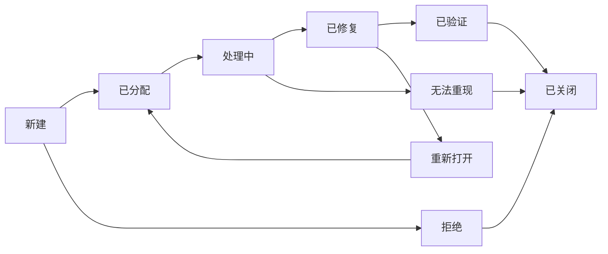

# 测试用例模板

_功能模块：`<模块名称>` | 测试版本：`1.0.0` | 日期：`YYYY-MM-DD`_

---

## 1. 测试概述

### 1.1 测试目标
验证`<功能模块>`是否符合需求规格，确保功能正确性、稳定性、安全性和用户体验。

### 1.2 测试范围
| 测试类型 | 覆盖范围 | 优先级 |
|----------|----------|--------|
| **功能测试** | 所有需求文档中定义的功能点 | P0 |
| **界面测试** | 用户界面布局、交互、响应式 | P1 |
| **兼容性测试** | 浏览器、操作系统、设备兼容 | P2 |
| **性能测试** | 响应时间、并发处理、负载能力 | P1 |
| **安全测试** | 认证授权、数据安全、漏洞防护 | P1 |
| **接口测试** | API接口功能、参数校验、错误处理 | P0 |

### 1.3 测试环境
| 环境 | 配置 | 用途 |
|------|------|------|
| **开发环境** | 本地开发机，Docker容器 | 开发自测、单元测试 |
| **测试环境** | 独立服务器，模拟生产配置 | 集成测试、系统测试 |
| **预发环境** | 与生产环境一致，隔离数据 | 验收测试、性能测试 |
| **生产环境** | 线上实际环境 | 监控验证、回归测试 |

### 1.4 测试策略
- **测试级别**：单元测试→集成测试→系统测试→验收测试
- **测试方法**：黑盒测试为主，白盒测试为辅
- **测试数据**：使用生产数据脱敏，结合自动化生成
- **缺陷管理**：Jira缺陷跟踪，每日缺陷评审

---

## 2. 测试用例设计

### 2.1 功能测试用例模板
```markdown
## TC-FUNC-001: <测试用例名称>

**所属模块**：`<模块名称>`
**优先级**：`P0/P1/P2/P3`
**测试类型**：`功能测试`
**前置条件**：
1. 用户已登录系统
2. 相关数据已准备就绪

**测试步骤**：
| 步骤 | 操作 | 预期结果 |
|------|------|----------|
| 1 | 进入`<页面>` | 页面正常加载 |
| 2 | 点击`<按钮>` | 弹出`<对话框>` |
| 3 | 输入`<数据>` | 输入框显示正确 |
| 4 | 提交表单 | 显示成功提示，数据保存正确 |

**测试数据**：
```json
{
  "username": "test_user",
  "password": "Test@123"
}
```

**后置条件**：
- 清理测试数据
- 恢复系统状态

**自动化标识**：`AUTO-001`（可自动化）
**测试人员**：`<姓名>`
**执行日期**：`YYYY-MM-DD`
```

### 2.2 界面测试用例模板
```markdown
## TC-UI-001: <测试用例名称>

**所属模块**：`<模块名称>`
**优先级**：`P1/P2`
**测试类型**：`界面测试`
**测试设备**：`桌面/平板/手机`
**浏览器**：`Chrome 120+/Firefox 115+/Safari 16+`

**检查点**：
- [ ] 页面布局符合设计稿（间距、对齐、字体）
- [ ] 颜色方案一致，无颜色异常
- [ ] 图片/图标显示正确，无失真
- [ ] 文字内容无错别字，无截断
- [ ] 交互元素有悬停/点击反馈
- [ ] 响应式布局适配不同屏幕尺寸
- [ ] 表单控件状态正确（禁用/只读/必填）
- [ ] 错误提示位置和样式正确

**截图参考**：`<设计稿链接>`
**测试人员**：`<姓名>`
```

### 2.3 接口测试用例模板
```markdown
## TC-API-001: <测试用例名称>

**接口名称**：`<API路径>`
**HTTP方法**：`GET/POST/PUT/DELETE/PATCH`
**请求头**：
```http
Authorization: Bearer <token>
Content-Type: application/json
```

**请求参数**：
```json
{
  "param1": "value1",
  "param2": 100
}
```

**预期响应**：
```json
{
  "code": 200,
  "message": "success",
  "data": {
    "id": "uuid",
    "name": "example"
  },
  "timestamp": "2024-01-01T00:00:00Z"
}
```

**状态码验证**：
- 200: 正常请求
- 400: 参数错误
- 401: 未授权
- 403: 无权限
- 404: 资源不存在
- 500: 服务器错误

**性能要求**：响应时间<200ms
**自动化脚本**：`api_tests/test_example.py`
```

### 2.4 性能测试用例模板
```markdown
## TC-PERF-001: <测试用例名称>

**测试场景**：`<场景描述>`
**测试工具**：`k6/Locust/JMeter`
**并发用户数**：`100/500/1000`
**测试时长**：`5分钟/15分钟/30分钟`

**性能指标**：
| 指标 | 目标值 | 实际值 | 是否达标 |
|------|--------|--------|----------|
| 平均响应时间 | <200ms | | |
| 95分位响应时间 | <500ms | | |
| 吞吐量 | >100 TPS | | |
| 错误率 | <0.1% | | |
| CPU使用率 | <70% | | |
| 内存使用率 | <80% | | |

**测试数据**：
- 数据量：`10000`条记录
- 数据分布：均匀分布
- 预热时间：`1`分钟

**监控指标**：
- 应用日志：错误日志数量
- 数据库：连接数、慢查询
- 服务器：CPU、内存、磁盘IO、网络

**测试报告**：`perf_report_YYYYMMDD.html`
```

### 2.5 安全测试用例模板
```markdown
## TC-SEC-001: <测试用例名称>

**安全领域**：`认证/授权/输入验证/数据保护`
**测试工具**：`OWASP ZAP/Burp Suite/Nessus`

**测试步骤**：
1. **SQL注入**：`' OR '1'='1`
   - 预期：参数化查询阻止注入，返回友好错误
2. **XSS攻击**：`<script>alert('xss')</script>`
   - 预期：输入被转义或过滤，不执行脚本
3. **CSRF攻击**：伪造请求测试
   - 预期：CSRF Token验证失败
4. **越权访问**：尝试访问其他用户数据
   - 预期：返回403无权限
5. **敏感信息泄露**：检查响应头、错误信息
   - 预期：无敏感信息泄露

**安全要求**：
- 传输层：TLS 1.3
- 存储层：密码加盐哈希，敏感数据加密
- 日志：不记录敏感信息
- 会话：Secure/HttpOnly Cookie

**扫描报告**：`security_scan_YYYYMMDD.pdf`
```

---

## 3. 测试数据管理

### 3.1 测试数据分类
| 数据类型 | 描述 | 生成方式 | 清理策略 |
|----------|------|----------|----------|
| **基础数据** | 用户、角色、权限等系统基础数据 | SQL脚本初始化 | 不清理 |
| **业务数据** | 订单、产品、交易等业务数据 | 自动化生成 | 每次测试后清理 |
| **边界数据** | 最大值、最小值、空值、特殊字符 | 手工构造 | 使用后清理 |
| **异常数据** | 非法格式、错误类型、超长数据 | 自动化生成 | 使用后清理 |

### 3.2 测试数据生成脚本示例
```python
# test_data_generator.py
import random
import string
from datetime import datetime, timedelta

def generate_user_data(count=10):
    """生成用户测试数据"""
    users = []
    for i in range(count):
        username = f"testuser_{random.randint(1000, 9999)}"
        email = f"{username}@example.com"
        phone = f"1{random.randint(3000000000, 3999999999)}"
        users.append({
            "username": username,
            "password": "Test@123456",
            "email": email,
            "phone": phone,
            "created_at": datetime.now() - timedelta(days=random.randint(1, 365))
        })
    return users

def generate_order_data(users, count=50):
    """生成订单测试数据"""
    orders = []
    statuses = ['pending', 'paid', 'shipped', 'completed', 'cancelled']
    for i in range(count):
        user = random.choice(users)
        orders.append({
            "order_number": f"ORD{datetime.now().strftime('%Y%m%d')}{i:06d}",
            "user_id": user["username"],
            "amount": round(random.uniform(10.0, 1000.0), 2),
            "status": random.choice(statuses),
            "items": [
                {"product_id": f"P{random.randint(1, 100)}", "quantity": random.randint(1, 5)}
                for _ in range(random.randint(1, 3))
            ]
        })
    return orders
```

### 3.3 数据清理策略
```sql
-- 清理测试数据SQL脚本
BEGIN TRANSACTION;

-- 标记测试数据（通过特定前缀或测试标记）
UPDATE users 
SET is_test = TRUE 
WHERE username LIKE 'testuser_%' OR email LIKE '%@test.example.com';

-- 删除测试业务数据（保留基础数据）
DELETE FROM orders WHERE user_id IN (
  SELECT username FROM users WHERE is_test = TRUE
);

-- 可选：删除测试用户（谨慎操作）
-- DELETE FROM users WHERE is_test = TRUE;

COMMIT;
```

---

## 4. 测试执行

### 4.1 测试执行计划
| 测试阶段 | 时间安排 | 负责人 | 主要活动 | 退出标准 |
|----------|----------|--------|----------|----------|
| **单元测试** | 开发过程中 | 开发工程师 | 代码覆盖、逻辑验证 | 覆盖率>80%，无阻塞缺陷 |
| **集成测试** | 模块开发完成 | 测试工程师 | 接口联调、数据流验证 | 接口测试通过率100% |
| **系统测试** | 全部功能完成 | 测试工程师 | 端到端流程、非功能测试 | 所有P0/P1用例通过 |
| **回归测试** | 每次发布前 | 测试工程师 | 核心功能验证、缺陷修复验证 | 回归用例通过率100% |
| **验收测试** | 上线前 | 产品+用户 | 业务场景验证、用户体验 | 用户签字确认 |

### 4.2 测试执行记录
```markdown
## 测试执行日志

**测试周期**：`YYYY-MM-DD` 至 `YYYY-MM-DD`
**测试版本**：`v1.2.3`
**测试人员**：`<姓名>`

### 每日执行摘要
| 日期 | 执行用例数 | 通过数 | 失败数 | 阻塞数 | 发现缺陷 | 备注 |
|------|------------|--------|--------|--------|----------|------|
| 01-01 | 150 | 145 | 3 | 2 | 5 | 环境问题导致2个阻塞 |
| 01-02 | 180 | 178 | 2 | 0 | 3 | 性能测试开始 |
| 01-03 | 120 | 118 | 2 | 0 | 2 | 回归测试阶段 |

### 缺陷趋势
| 日期 | 新增 | 解决 |  reopen | 未解决 | 严重/高/中/低 |
|------|------|------|---------|--------|--------------|
| 01-01 | 5 | 2 | 0 | 3 | 1/2/1/1 |
| 01-02 | 3 | 4 | 1 | 1 | 0/1/1/1 |
| 01-03 | 2 | 3 | 0 | 0 | 0/0/1/1 |

### 测试环境问题
1. **问题**：测试数据库连接超时
   **影响**：10个用例阻塞
   **解决**：DBA调整连接池配置
   **状态**：已解决

2. **问题**：第三方支付接口沙箱不稳定
   **影响**：支付相关测试受影响
   **解决**：使用Mock服务替代
   **状态**：已规避
```

### 4.3 测试暂停/继续标准
**暂停测试条件**（满足任一）：
1. 测试环境不可用时间>2小时
2. 阻塞缺陷导致>30%用例无法执行
3. 版本质量严重下降，缺陷率>10%
4. 需求发生重大变更

**继续测试条件**（全部满足）：
1. 环境问题已解决
2. 阻塞缺陷已修复并验证
3. 新版本质量达标
4. 测试计划已更新

---

## 5. 缺陷管理

### 5.1 缺陷严重程度定义
| 严重程度 | 描述 | 修复优先级 | 响应时间 |
|----------|------|------------|----------|
| **致命（P0）** | 系统崩溃、数据丢失、安全漏洞 | 立即修复 | 2小时内 |
| **严重（P1）** | 核心功能不可用，无替代方案 | 高优先级 | 4小时内 |
| **一般（P2）** | 功能异常但有替代方案 | 正常排队 | 24小时内 |
| **轻微（P3）** | 界面问题、提示不友好、建议改进 | 低优先级 | 迭代内修复 |

### 5.2 缺陷生命周期


### 5.3 缺陷报告模板
```markdown
## 缺陷报告 DBG-XXX

**标题**：`<简短描述问题>`
**严重程度**：`P0/P1/P2/P3`
**优先级**：`高/中/低`
**模块**：`<模块名称>`
**版本**：`v1.2.3`

**环境信息**：
- 操作系统：`Windows 11/ macOS 14/ Ubuntu 22.04`
- 浏览器：`Chrome 120.0.6099.110`
- 设备：`桌面/iPhone 15/Android 14`
- 网络：`WiFi/4G/5G`

**重现步骤**：
1. 打开`<URL>`
2. 点击`<按钮>`
3. 输入`<数据>`
4. 观察`<现象>`

**预期结果**：
`<描述应有的正确行为>`

**实际结果**：
`<描述实际发生的错误行为>`

**截图/日志**：

```
日志附件或错误堆栈

**影响分析**：
- 影响用户：`所有用户/部分用户`
- 影响功能：`核心功能/次要功能`
- 业务影响：`<描述业务影响>`

**备注**：
`<其他相关信息>`

**报告人**：`<姓名>`
**报告时间**：`YYYY-MM-DD HH:MM`
```

### 5.4 缺陷分析指标
| 指标 | 计算公式 | 目标值 | 说明 |
|------|----------|--------|------|
| **缺陷密度** | 缺陷数 / KLOC | <1个/KLOC | 千行代码缺陷数 |
| **缺陷解决率** | 已解决缺陷 / 总缺陷 | >95% | 当前迭代缺陷解决比例 |
| **平均修复时间** | 总修复时间 / 缺陷数 | <4小时 | 从分配到修复的时间 |
| **重新打开率** | 重新打开缺陷 / 总缺陷 | <5% | 修复质量指标 |
| **缺陷分布** | 按模块/类型/严重程度分布 | - | 识别问题集中区域 |

---

## 6. 测试报告

### 6.1 测试报告模板
```markdown
# 测试报告

_项目名称：`<项目名称>` | 测试周期：`YYYY-MM-DD 至 YYYY-MM-DD` | 报告版本：`1.0`_

## 1. 测试概要

### 1.1 测试目标
`<简要描述本次测试的目标>`

### 1.2 测试范围
| 测试类型 | 计划用例数 | 执行用例数 | 执行率 | 通过率 |
|----------|------------|------------|--------|--------|
| 功能测试 | 150 | 148 | 98.7% | 96.6% |
| 界面测试 | 50 | 50 | 100% | 94.0% |
| 性能测试 | 10 | 10 | 100% | 90.0% |
| 安全测试 | 15 | 15 | 100% | 100% |
| 接口测试 | 80 | 80 | 100% | 98.8% |
| **总计** | **305** | **303** | **99.3%** | **96.7%** |

### 1.3 测试环境
- **测试服务器**：IP `192.168.1.100`，配置 `8C16G`
- **数据库**：PostgreSQL 15.2，Redis 7.2
- **测试工具**：Jira, TestRail, k6, OWASP ZAP

## 2. 测试结果分析

### 2.1 缺陷统计
| 严重程度 | 新建 | 已解决 | 未解决 | 解决率 |
|----------|------|--------|--------|--------|
| 致命（P0） | 0 | 0 | 0 | 100% |
| 严重（P1） | 3 | 3 | 0 | 100% |
| 一般（P2） | 8 | 8 | 0 | 100% |
| 轻微（P3） | 5 | 3 | 2 | 60% |
| **总计** | **16** | **14** | **2** | **87.5%** |

### 2.2 缺陷趋势图
（此处插入缺陷趋势图表）

### 2.3 模块质量分析
| 模块名称 | 用例数 | 缺陷数 | 缺陷密度 | 质量评级 |
|----------|--------|--------|----------|----------|
| 用户管理 | 45 | 2 | 0.044 | A |
| 订单管理 | 60 | 5 | 0.083 | B |
| 支付模块 | 40 | 3 | 0.075 | B |
| 后台管理 | 50 | 4 | 0.080 | B |
| 报表统计 | 30 | 2 | 0.067 | A |

## 3. 性能测试结果

### 3.1 性能指标
| 场景 | 并发用户 | 平均响应时间 | 95分位响应时间 | 吞吐量 | 错误率 |
|------|----------|--------------|----------------|--------|--------|
| 用户登录 | 100 | 156ms | 234ms | 85 TPS | 0% |
| 创建订单 | 50 | 189ms | 312ms | 42 TPS | 0% |
| 查询订单 | 200 | 124ms | 198ms | 156 TPS | 0% |

### 3.2 资源使用情况
| 服务器 | CPU使用率 | 内存使用率 | 磁盘IO | 网络带宽 |
|--------|-----------|------------|--------|----------|
| Web服务器 | 45% | 62% | 15 MB/s | 8 Mbps |
| 数据库 | 38% | 55% | 22 MB/s | 3 Mbps |
| 缓存服务器 | 28% | 48% | 2 MB/s | 5 Mbps |

## 4. 风险评估

### 4.1 剩余风险
| 风险描述 | 可能性 | 影响 | 缓解措施 | 责任人 |
|----------|--------|------|----------|--------|
| 第三方支付接口偶发超时 | 低 | 中 | 增加超时重试，完善错误提示 | 后端组 |
| 高并发下数据库连接池可能不足 | 中 | 高 | 监控连接数，动态调整连接池 | DBA |

### 4.2 质量评估
**整体质量评级**：`B+`（良好）

**优势**：
1. 核心功能稳定，通过率100%
2. 性能指标达到预期目标
3. 安全扫描无高危漏洞

**待改进**：
1. 界面细节需要优化（P3缺陷）
2. 部分错误提示不够友好
3. 移动端适配需加强

## 5. 测试结论

### 5.1 发布建议
- [ ] **建议发布**：所有P0/P1缺陷已修复，核心功能稳定
- [ ] **有条件发布**：存在已知问题但不影响核心功能，需在发布说明中告知用户
- [ ] **不建议发布**：存在未解决的P0/P1缺陷，或性能不达标

**本次测试结论**：`建议发布`

### 5.2 后续建议
1. **短期**（本次迭代）：
   - 修复剩余的2个P3缺陷
   - 优化移动端显示问题

2. **中期**（下个迭代）：
   - 增加自动化测试覆盖率
   - 完善性能监控告警

3. **长期**（产品规划）：
   - 建立全链路压测环境
   - 实施混沌工程，提升系统韧性

## 6. 附录

### 6.1 测试用例清单
（附件：test_cases_YYYYMMDD.xlsx）

### 6.2 缺陷清单
（附件：defects_YYYYMMDD.xlsx）

### 6.3 性能测试报告
（附件：performance_report_YYYYMMDD.pdf）

### 6.4 安全扫描报告
（附件：security_scan_YYYYMMDD.pdf）

---

**测试负责人**：`<姓名>`
**报告日期**：`YYYY-MM-DD`
**批准人**：`<姓名>`（质量负责人）
```

---

## 7. 自动化测试

### 7.1 自动化测试框架
| 测试类型 | 框架/工具 | 语言 | 适用范围 |
|----------|------------|------|----------|
| **单元测试** | pytest, Jest | Python, JavaScript | 函数、组件、工具类 |
| **接口测试** | pytest + requests, Postman | Python | RESTful API测试 |
| **UI自动化** | Playwright, Cypress | TypeScript, JavaScript | 端到端功能测试 |
| **性能测试** | k6, Locust | JavaScript, Python | 负载测试、压力测试 |
| **安全测试** | OWASP ZAP API | Python, Shell | 自动化安全扫描 |

### 7.2 自动化测试目录结构
```
tests/
├── unit/                    # 单元测试
│   ├── frontend/           # 前端单元测试
│   │   ├── components/     # 组件测试
│   │   ├── utils/         # 工具函数测试
│   │   └── store/         # 状态管理测试
│   └── backend/           # 后端单元测试
│       ├── models/        # 数据模型测试
│       ├── services/      # 业务逻辑测试
│       └── utils/         # 工具类测试
├── integration/            # 集成测试
│   ├── api/               # API接口测试
│   └── database/          # 数据库集成测试
├── e2e/                    # 端到端测试
│   ├── specs/             # 测试用例
│   ├── fixtures/          # 测试数据
│   └── pages/             # 页面对象模型
├── performance/            # 性能测试
│   ├── scenarios/         # 测试场景
│   └── data/              # 测试数据
└── security/               # 安全测试
    ├── scans/             # 安全扫描脚本
    └── reports/           # 扫描报告
```

### 7.3 自动化测试执行
```yaml
# GitHub Actions 自动化测试配置
name: Automated Tests

on:
  push:
    branches: [main, develop]
  pull_request:
    branches: [main]

jobs:
  test:
    runs-on: ubuntu-latest
    
    steps:
    - uses: actions/checkout@v3
    
    - name: Setup Python
      uses: actions/setup-python@v4
      with:
        python-version: '3.11'
    
    - name: Install dependencies
      run: |
        pip install -r requirements.txt
        pip install pytest pytest-cov
        
    - name: Run unit tests
      run: |
        pytest tests/unit/ --cov=app --cov-report=xml
        
    - name: Run integration tests
      run: |
        pytest tests/integration/ --cov=app --cov-append
        
    - name: Upload coverage
      uses: codecov/codecov-action@v3
      with:
        file: ./coverage.xml
        
    - name: Security scan
      run: |
        pip install safety
        safety check --json > security-report.json
        
    - name: Performance test
      run: |
        npm install -g k6
        k6 run tests/performance/basic.js
```

---

## 8. 测试工具和资源

### 8.1 测试工具列表
| 工具类别 | 工具名称 | 用途 | 许可证 |
|----------|----------|------|--------|
| **测试管理** | TestRail, Zephyr | 测试用例管理、执行跟踪 | 商业/开源 |
| **缺陷跟踪** | Jira, Bugzilla | 缺陷报告、跟踪、统计 | 商业/开源 |
| **自动化测试** | Selenium, Playwright | Web UI自动化测试 | 开源 |
| **接口测试** | Postman, Insomnia | API测试、Mock服务 | 商业/开源 |
| **性能测试** | JMeter, k6 | 负载测试、压力测试 | 开源 |
| **安全测试** | OWASP ZAP, Burp Suite | 安全漏洞扫描 | 开源/商业 |
| **移动测试** | Appium, Detox | 移动端自动化测试 | 开源 |
| **监控分析** | Grafana, Kibana | 测试监控、日志分析 | 开源 |

### 8.2 测试资源链接
1. **官方文档**：
   - [pytest官方文档](https://docs.pytest.org/)
   - [Playwright官方文档](https://playwright.dev/)
   - [k6官方文档](https://k6.io/docs/)

2. **最佳实践**：
   - [Google测试博客](https://testing.googleblog.com/)
   - [Martin Fowler测试策略](https://martinfowler.com/tags/testing.html)
   - [敏捷测试四象限](https://www.agilealliance.org/glossary/quadrants/)

3. **社区资源**：
   - [软件测试社区](https://www.softwaretestinghelp.com/)
   - [测试自动化大学](https://testautomationu.applitools.com/)
   - [Ministry of Testing](https://www.ministryoftesting.com/)

---

**模板状态**：`草案/评审中/已批准`

**编制人**：`<姓名>`（测试负责人）

**评审人**：`<姓名1>`，`<姓名2>`，`<姓名3>`

**适用项目**：`所有Web/移动端/后端项目`

**版本历史**：
- v1.0.0 (YYYY-MM-DD): 初始版本
- v1.1.0 (YYYY-MM-DD): 增加自动化测试章节
- v1.2.0 (YYYY-MM-DD): 优化测试报告模板